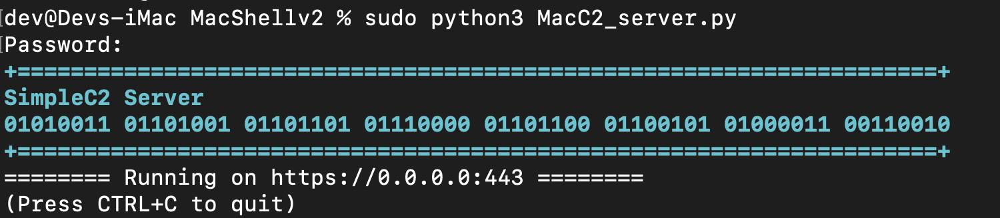
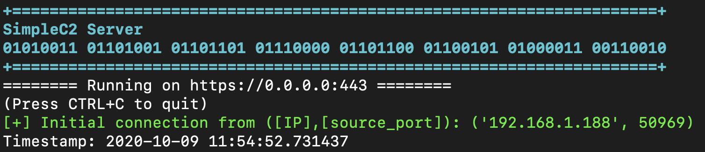
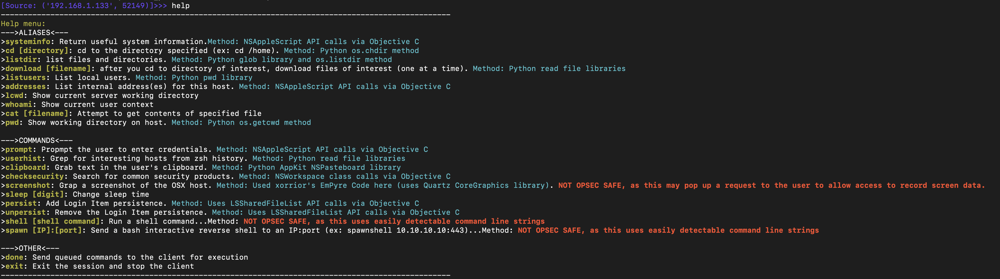

# MacC2
MacC2 is a macOS post exploitation tool written in python that uses Objective C calls or python libraries as opposed to command line executions. I wrote this tool as a way for defenders and offensive security researchers to more easily understand the inner workings of python-based post exploitation tools on macOS.

This tool consists of three scripts: a server script, a client script, and a macro generator.

Since the MacC2 server uses the aiohttp library for communications, you will need to install aiohttp first:

_*pip install aiohttp (if you encounter an error ensure that pip is pointing to python3, since aiohttp is a python3 library): python3 -m pip install --upgrade --force pip*_

More info below:

**_On C2 Server:_**
1. Set up ssl (note: use a key size of at least 2048)

If you do not have your own cert, you can use the following to generate a self signed cert:

- 1: openssl req -new -newkey rsa:2048 -nodes -out ca.csr -keyout ca.key

- 2: openssl x509 -trustout -signkey ca.key -days 365 -req -in ca.csr -out ca.pem

_*note: the server script is hard-coded to use ca.pem and ca.key, so keep these names the same for now, or change the code appropriately_

2. Use macro_generator.py to create the MacC2 scripts with the server's IP/domain and port. macro_generator.py also builds a macro (macro.txt) that uses hex encoding to run MacC2. You can copy and paste the contents of macro.text into an MS Office document:

Usage: python3 macro_generatory.py -s [C2 Server IP/domain] -p [C2 Server Port]

-Example:

3. Start the generated MacC2_server.py script to listen for a connection:

**_On Client Side (the target mac host):_**
1. If you desire to not be limited by the mac sandbox and want more functionality, you may opt to copy the MacC2_client.py script to the client (assuming you have access).

2. On the client, run the MacC2_client.py script: "% python MacC2_client.py"

3. On the server, you will see an inbound connection. Example below:

***Using MacC2***

After you receive a connection, you can use the "help" command on the server to get a list of built-in commands available. You can enter one of these commands. After entering a command and pressing Enter, the command is queued up (allows you to enter multiple commands to be executed by the client). Once you type "done" and hit Enter, all of the queued commands will be sent to the client for execution.

Each command is pretty straightforward. The command options that are not OPSEC safe (i.e., command line executions or cause pop ups) are also flagged in red from the help menu.

----------

**_Additional Info_**

The MacC2 server uses aiohttp to easily allow for asynchronous web comms. To ensure that only MacC2 agents can access the server, the server includes the following:

- A specific user agent string check (if a request fails this check it receives a 404 Not Found)

- A specific token (if a request failes this check it receives a 404 Not Found)

The operator flow after setting everything up and getting a callback is:

- view help menu for command options

- enter command name and press enter for each command you want to run

- enter "done" and press enter to have the queued commands sent to the client for execution

- NOTE: The default sleep is 10 seconds. The operator can change that by using the sleep [numberofseconds] command.

----------

**_Macro Limitations_**

MacC2 does NOT include any sandbox escapes and therefore all functions do not work when access is gained via the Office macro. Functions that do work include:

- systeminfo

- addresses

- prompt (the prompt is hidden under the python tray icon though...)

- clipboard

- shell (not OPSEC safe)

- spawn (not OPSEC safe)

- cd and listdir (sandbox prevents access for most directories but you can see the root '/' directory and potentially others as well)

----------

**_DISCLAIMER_**

This is for academic purposes and should not be used maliciously or without the appropriate authorizations and approvals.
